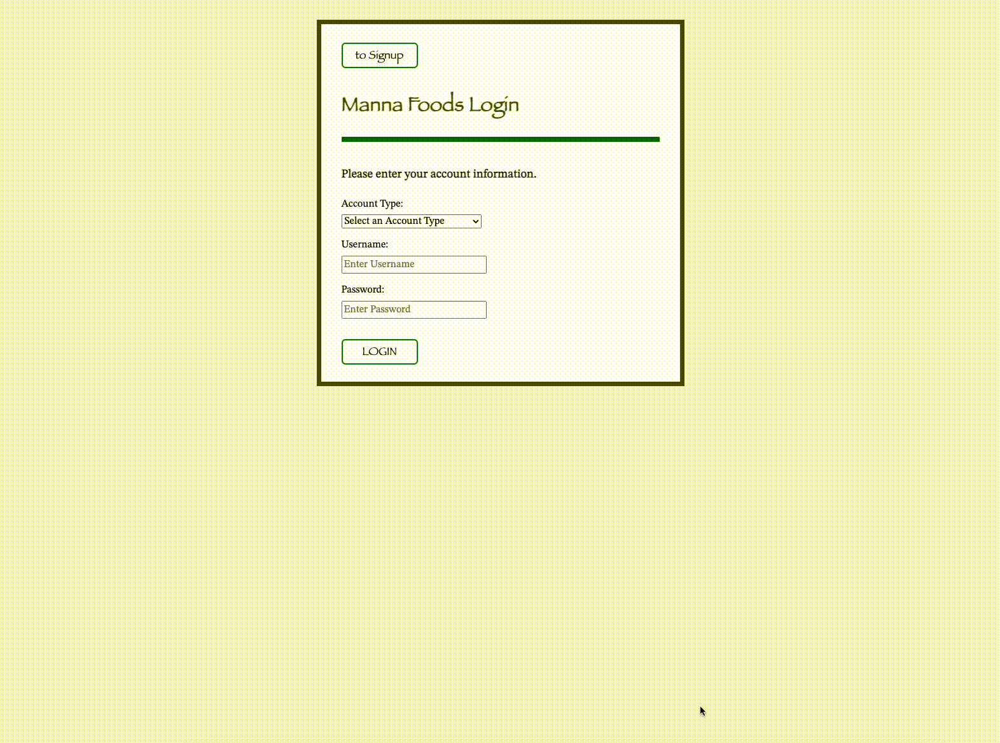
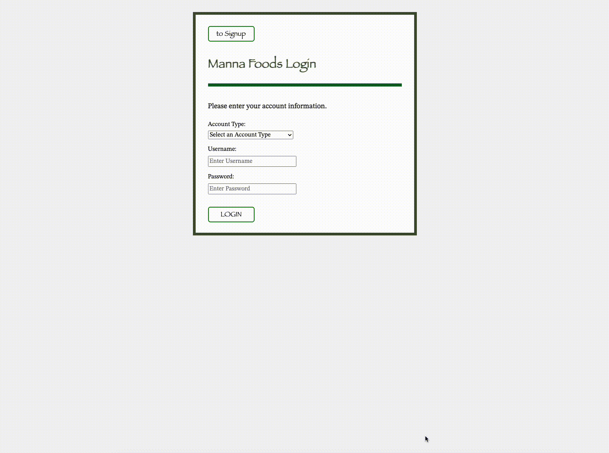
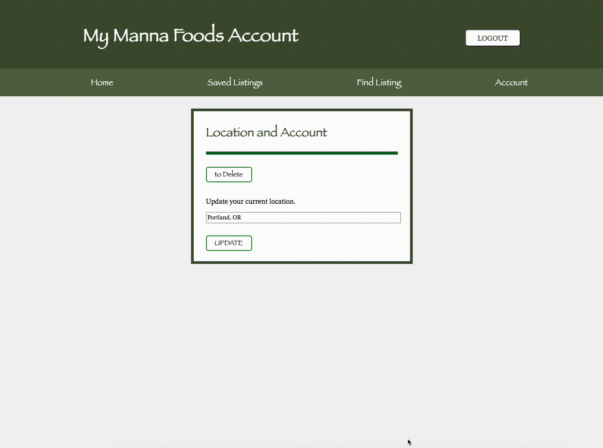

# Manna Foods Web App

## Project Description

This SPA [single page application] is a React / Flask app that allows businesses, namely restaurants and grocers, to post listings of surplus food for users to come pick up at no personal expense. Individuals can create an account as either a user or business. Users can browse and save listings, while businesses can create and edit listings. Listings are location-based and can be filtered for specific keywords and dietary restrictions. The app seeks to address the problems of hunger and food waste by creating digital infrastructure that can help redirect surplus food into the hands of needy individuals.

## Usage: Signup [User Only]

1. Create a free account by using the login / signup form.
2. On the login page, click 'signup' to toggle the signup form.
3. Choose your account type [user].
4. Enter the appropriate information and submit the form.

## Usage: Signup [Business Only]

1. Create a free account by using the login / signup form.
2. On the login page, click 'signup' to toggle the signup form.
3. Choose your account type [business].
4. Enter the appropriate information and submit the form.

## Usage: Update Location [User or Business]

1. Before you begin using Manna Foods, be sure to update your location.
2. Navigate to the Account tab and simply enter your new location. This can be in the form of an address, zipcode, city, etc.
3. Saving one's location allows users to browse listings by distance.
4. This also allows businesses to set a default pickup location for all future listings.

## Usage: Find and Save Listings [User Only]

1. Navigate to the Find Listings tab to see all active listings.
2. Filter / search for specific listings by keyword(s).
3. See listing details and save desired listings.
4. Remove listings from your saved collection.

## Usage: Create and Edit Listings [Business Only]

1. Navigate to the Create Listing tab to create a new listing.
2. Fill in all the pertinent information. Be sure not to leave any details blank.
3. If you have already updated your location, it will be autofilled.
4. Remember to update quantities and delete listings as items are picked up.
5. Please be honest and precise concerning expiration dates and dietary restrictions.
6. Your active listings can be viewed and edited in My Listings.
7. Click 'Details' to view the specifics of any active listing.
8. Modify listing details, as desired. Click 'Edit' to save changes.

## Usage: Delete Account [User or Business]

1. Navigate to your Account page.
2. Click 'to Delete' to toggle the Delete form.
3. Confirm your username and password to delete your account.

## Notes on Environment Variables

1. The Maps API key has not been uploaded to the GitHub repo.
2. The Flask SECRET_KEY has not been uploaded to the GitHub repo.
3. The app will not run properly without these two keys provided.

## Credits

Code written, tested, and submitted by Joseph Lee.

Github: https://github.com/joeylee08

Codepen: https://codepen.io/joeylee08

LinkedIn: https://www.linkedin.com/in/joeylee08/